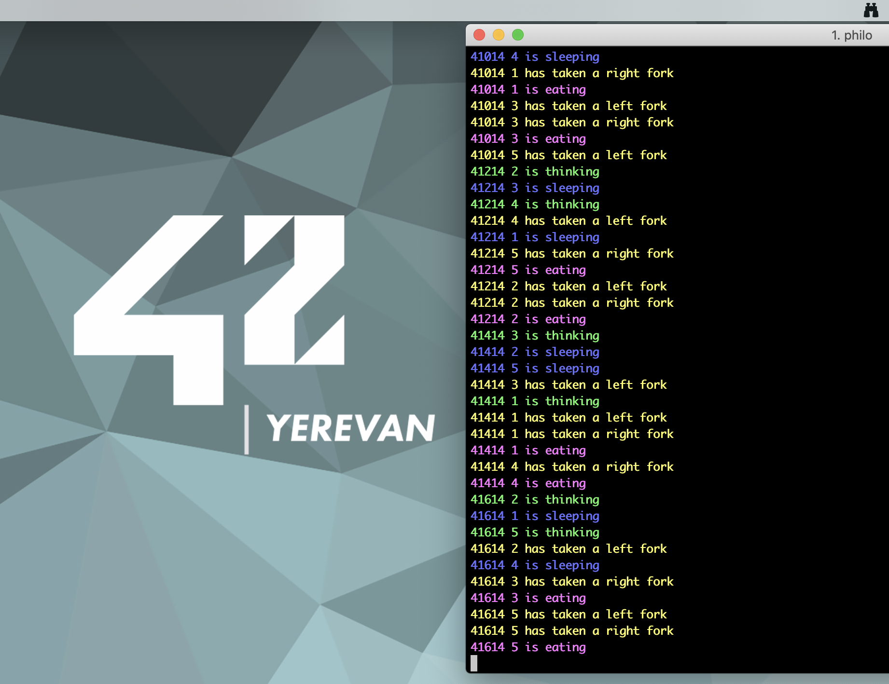

# Philosophers
2
_I never thought philosophy would be so deadly_
3

4
__42 project__ about inter-process communication. A program that can monitor multiple instances of itself, either processes or threads, using semaphores or mutexes.
5

6
### Concept
7

8
One or more philosophers sit at a round table. There is a large bowl of spaghetti in the middle of the table. There are __as many forks as philosophers__. Because serving and eating spaghetti with only one fork is very inconvenient, a philosopher takes their right and their left forks to eat, one in each hand _(they each have a fork, but they need two forks to eat)_. So they need to borrow their neighbor's fork to eat. The philosophers alternatively __eat__, __think__, or __sleep__. When a philosopher has finished eating, they put their forks back on the table and start sleeping. Once awake, they start thinking again. The simulation stops when a philosopher dies of starvation. Every philosopher needs to eat and should never starve. No need to say that philosophers should avoid dying!
9
* __Philosophers don’t speak with each other.__
10
* __Philosophers don’t know if another philosopher is about to die.__
11
___
12
### How to use it
13

14
Using ``make`` in the 42_Philosophers directory will create the ``philo`` executable.
15

16
You run it specifying, in order :
17
* The number of philosophers
18
* The time in milliseconds until a philosopher dies from starvation
19
* The time in milliseconds it takes for a philosopher to eat
20
* The time in milliseconds it takes for a philosopher to sleep
21
* (Optional) The number of meals before the program stops
22
___
23
### Output
24

25
The program outputs every action with a timestamp (in milliseconds) and the philosopher's number. For example, if Philosopher 2 starts eating 369 milliseconds after the beginning of the program, it will output :
26

27
```
28
369 2 is eating
29
```
30
Each philosopher has a number ranging from 1 to number\_of\_philosophers.
31
___
32
### Examples
33
* Test with ```./philo 1 800 200 200```, the philosopher should not eat and should die!
34
* Test with ```./philo 5 800 200 200```, no one should die!
35
* Test with ```./philo 5 800 200 200 7```, no one should die and the simulation should stop when all the philosopher has eaten at least 7 times each.
36
* Test with ```./philo 4 410 200 200```, no one should die!
37
* Test with ```./philo 4 310 200 100```, a philosopher should die!
38
* Do not test with more than 200 philosophers
39
* Do not test with time_to_die or time_to_eat under 60 ms
40
* Test with 2 philosophers and check the different times (a death delayed by more than 10 ms is unacceptable)
41

42
___
43
### Additional information
44
**Philos** does their works using **threads** as philosophers, and **mutexes** as forks.
45
For more information you can read the en.subject.pdf. My code does not have memory leaks and it passes all the tests.
46

@nenieiri
Add photo to readme file
7 months ago
47

